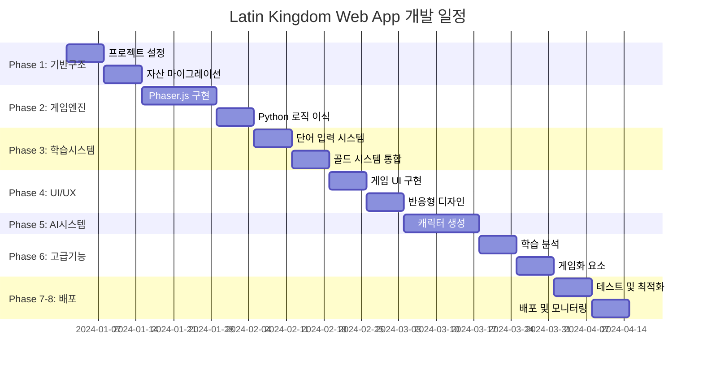

# 게임 PRD: Latin Vocabulary Tower Defense Web App

## 📋 프로젝트 개요

### 목적
- **주요 목표**: 아이들이 라틴어 단어를 재미있게 외울 수 있도록 타워 디펜스 게임을 활용
- **기술적 목표**: 기존 [Python Pygame 기반의 Kingdom Defender 게임](https://github.com/jaylikescode/latin_kingdom)을 웹 앱으로 완전 이식
- **혁신적 요소**: AI를 통해 사용자의 사진을 캐릭터 이미지로 생성하여 개인화된 게임 경험 제공

### 목표 사용자
- **1차 사용자**: 라틴어를 배우는 11‒16세 학생
- **2차 사용자**: 숙제를 게임으로 변환하고 싶어하는 선생님과 부모

### 기반 게임 분석
**원본 게임 구조** ([GitHub Repository](https://github.com/jaylikescode/latin_kingdom)):
```
기존 Python 게임 구성 요소:
├── 게임 로직 시스템
│   ├── main.py (게임 진입점)
│   ├── game.py (핵심 게임 로직)
│   └── constants.py (게임 상수)
├── 게임 오브젝트
│   ├── tower.py (3가지 타워: archer, magic, cannon)
│   ├── enemy.py (4가지 적: goblin, orc, troll, dragon)
│   ├── projectile.py (발사체 시스템)
│   ├── explosion.py (폭발 효과)
│   ├── portal.py (적 스폰 포털)
│   └── coin_pickup.py (코인 수집)
└── 멀티미디어 자산
    ├── PNG 이미지 (background, castle, towers, enemies)
    ├── GIF 애니메이션 (explode, portal)
    └── MP3 오디오 (tower_shoot, enemy_death, coin_pickup)
```

## 🎯 핵심 기능 요구사항

### 1. 기존 게임 메커니즘 이식 (Python → Web)
- **타워 디펜스 시스템**: 기존 3종 타워 (Archer $50, Magic $100, Cannon $150) 완전 재현
- **적 시스템**: 4종 적 (Goblin, Orc, Troll, Dragon) 및 HP/속도/보상 시스템 유지
- **발사체 및 폭발 효과**: 기존 projectile.py와 explosion.py 로직을 웹에서 재구현
- **포털 시스템**: portal.py의 적 스폰 메커니즘 이식
- **오디오 시스템**: 타워 발사음, 적 사망음, 코인 획득음 등 모든 사운드 효과 유지

### 2. 라틴어 학습 시스템 (신규 추가)
- **골드 획득 메커니즘**: 
  - 화면 사이드 패널에 영단어 의미 제시
  - 해당 라틴어 단어를 정확히 입력하면 골드 획득
  - 기존 "적을 죽여서 골드 획득" 시스템과 병행
- **오답 힌트 시스템**: 
  - 단어를 틀리면 한 글자씩 공개
  - 노출된 글자 수에 따라 획득 골드 감소
  - 최대 3번까지 재시도 기회 제공
- **단어 리스트 관리**: 
  - Supabase DB에서 과제별 단어 리스트 로드
  - UI 상단에 영단어 의미 리스트 투명 박스로 표시
  - 실시간 키보드 입력 지원

### 3. 즉각적 피드백 시스템
- **실시간 정답 검증**: 입력 즉시 서버에서 정답 확인
- **시각적 피드백**: 정답/오답에 따른 색상 변화 및 애니메이션
- **오디오 피드백**: 정답/오답에 따른 효과음 재생
- **진행도 표시**: 학습한 단어 수 / 전체 단어 수 표시

### 4. AI 캐릭터 생성 시스템
- **사진 업로드**: 사용자 사진을 게임 캐릭터로 변환
- **다양한 스타일**: 중세 기사, 로마 군인 등 테마별 스타일 제공
- **매 게임 변화**: 세션마다 새로운 캐릭터 이미지 생성 옵션

### 5. 학습 효과 극대화 시스템
- **적응형 난이도**: 단어 수와 플레이어 수준에 따른 몬스터 스폰 조절
- **진행도 시각화**: 경험치 바, 배지, 레벨 시스템
- **복습 시스템**: 게임 종료 후 틀린 단어 복습 기능
- **성취 시스템**: 연속 정답, 빠른 입력 등에 대한 보너스

게임 디자인 개선 제안
	•	즉각적 피드백: 연구에서 즉각적이고 구체적인 피드백이 학습 동기와 정보 정착에 중요하다고 강조합니다 . 단어 입력 결과를 실시간으로 제공하고, 오답의 경우 즉시 힌트와 재도전 기회를 줍니다.
	•	스토리텔링과 세계관: 아이들이 더 몰입할 수 있도록 라틴어 단어와 테마를 결합한 작은 서사(예: 로마 신화 속 세계, 용사 이야기 등)를 제공합니다. 이야기를 통해 정보를 연결하면 새로운 지식을 쉽게 습득할 수 있습니다 .
	•	다양한 타입의 재미: 게임 연구자 Nicole Lazzaro는 도전적 재미, 탐험적 재미, 사회적 재미, 의미 있는 재미 등 여러 유형의 재미를 결합해야 한다고 말합니다 . 이 게임에는 전략과 도전 요소(포탑 업그레이드), 탐험 요소(새로운 장소나 몬스터), 친구들과의 협동/경쟁(리더보드), 학습 성취에 따른 의미 있는 만족감을 포함할 수 있습니다.
	•	선택의 자유: 학생이 여러 포탑과 업그레이드 중 선택할 수 있게 하여 전략적 결정이 결과에 영향을 미치게 합니다. 게임은 선택이 의미 있고 결과에 따라 바뀌어야 재미있습니다 .
	•	난이도 조절: 게임은 플레이어의 수준에 맞춰 몬스터 스폰 속도와 단어 길이 등을 조절해 새로운 도전을 제공해야 합니다. 너무 쉽거나 너무 어려우면 재미가 떨어집니다 . Supabase의 단어 갯수에 따라 한 스테이지를 구성하고, 파도 수를 조절합니다.
	•	진행 표시: 경험치 바, 배지, 레벨업 애니메이션 등 시각적 진행 표시를 통해 성취감을 강화합니다 .
	•	패배 시 학습 보조: 게임에서 체력을 잃어 패배하면 모든 단어와 해석을 보여 주고, 틀린 단어에 대한 설명 및 예문을 제공해 다음 도전에 대비하게 합니다.
	•	접근성 및 UI/UX: 아이들이 쉽게 사용할 수 있도록 깔끔한 레이아웃과 큰 버튼, 명확한 아이콘을 사용합니다. 모바일과 데스크톱 모두 대응하도록 반응형 디자인으로 구현합니다.

## 🛠 기술 스택 및 아키텍처

### 프론트엔드 스택
```typescript
Framework: Next.js 14 + TypeScript
Styling: Tailwind CSS + Styled Components
Game Engine: Phaser.js 3.70+ (Canvas 기반 게임 로직)
State Management: Zustand (게임 상태) + React Query (API 캐싱)
Audio: Web Audio API + Howler.js
Deployment: Vercel
```

### 백엔드 스택
```sql
Database: Supabase (PostgreSQL 기반)
Authentication: Supabase Auth (소셜 로그인)
Real-time: Supabase Realtime (실시간 점수)
Edge Functions: Supabase Functions (정답 검증)
File Storage: Supabase Storage (이미지 저장)
```

### AI 서비스 통합
```yaml
Image Generation: 
  - Primary: OpenAI DALL-E 3
  - Fallback: Stable Diffusion
  - Backup: Midjourney API
Character Styles:
  - Medieval Knight
  - Roman Soldier  
  - Fantasy Wizard
  - Custom themes
```

### 데이터베이스 스키마 설계
```sql
-- 사용자 관리
users (
  id UUID PRIMARY KEY,
  email TEXT UNIQUE,
  name TEXT,
  avatar_url TEXT,
  created_at TIMESTAMP
);

-- 과제 관리
assignments (
  id UUID PRIMARY KEY,
  title TEXT NOT NULL, -- "6th defender's Week 3"
  description TEXT,
  difficulty_level INTEGER, -- 1-5
  total_words INTEGER,
  created_at TIMESTAMP
);

-- 단어 관리
vocabularies (
  id UUID PRIMARY KEY,
  assignment_id UUID REFERENCES assignments(id),
  english_meaning TEXT NOT NULL,
  latin_word TEXT NOT NULL,
  difficulty INTEGER, -- 1-5
  word_length INTEGER,
  hints JSONB -- 단계별 힌트
);

-- 게임 세션
game_sessions (
  id UUID PRIMARY KEY,
  user_id UUID REFERENCES users(id),
  assignment_id UUID REFERENCES assignments(id),
  start_time TIMESTAMP,
  end_time TIMESTAMP,
  status TEXT, -- 'playing', 'completed', 'failed'
  final_score INTEGER,
  words_learned INTEGER,
  accuracy_rate DECIMAL
);

-- 학습 진행도
learning_progress (
  id UUID PRIMARY KEY,
  user_id UUID REFERENCES users(id),
  vocabulary_id UUID REFERENCES vocabularies(id),
  attempts INTEGER DEFAULT 0,
  correct_answers INTEGER DEFAULT 0,
  last_answered TIMESTAMP,
  mastery_level INTEGER -- 0-100
);
```

사용자 흐름
	1.	로그인/시작: 사용자는 게임 페이지에 접속하여 과제(예: “6th defender’s Week 3 - Latin Vocabulary”)를 선택합니다.
	2.	사진 업로드: 원하는 경우 자신의 사진을 업로드하여 주인공 캐릭터를 생성합니다.
	3.	단어 리스트 확인: 게임 상단 또는 사이드바에 영어 의미 리스트가 투명 박스로 표시됩니다.
	4.	게임 플레이: 몬스터가 루트를 따라 등장합니다. 플레이어는 키보드로 라틴어 단어를 입력하여 골드를 얻고 마우스로 포탑을 배치합니다. 정답/오답 피드백을 즉시 제공합니다.
	5.	진행과 성장: 골드를 모아 다양한 탑을 지어 업그레이드하고, 스테이지를 진행하면서 배지와 레벨을 획득합니다.
	6.	게임 종료: 모든 파도를 막으면 승리 메시지가 나오고 성과가 저장됩니다. 패배 시에는 모든 라틴어 단어와 해석이 표시되어 복습할 수 있습니다.

비기능 요구사항
	•	성능: 페이지 로딩 시 기본 게임 자산(타워, 몬스터 이미지)을 빠르게 로드하고, 동적 자산(캐릭터 이미지)은 로딩 화면을 보여줍니다.
	•	확장성: 새로운 단어와 과제가 쉽게 추가되도록 Supabase DB 스키마를 설계합니다.
	•	접근성: 색맹 모드, 폰트 사이즈 조절, 키보드 전용 모드 제공. 소리 및 시각적 효과 모두 제공하지만 음소거 옵션 추가.
	•	모든 주요 브라우저 및 모바일 지원.

## 🚀 단계별 개발 계획 (Step-by-Step Development)

### Phase 1: 프로젝트 설정 및 기반 구조 (1-2주)

#### 1.1 프로젝트 초기화
```bash
# 개발 환경 설정
create-next-app latin-kingdom-web --typescript --tailwind
cd latin-kingdom-web
npm install phaser zustand @tanstack/react-query howler.js
npm install @supabase/supabase-js @supabase/auth-helpers-nextjs
```

#### 1.2 기존 자산 마이그레이션
```
자산 마이그레이션 체크리스트:
├── 이미지 변환 (Python → Web)
│   ├── background.png → public/assets/images/
│   ├── castle.png → public/assets/images/
│   ├── 타워 이미지들 (archer_tower.png, magic_tower.png, cannon_tower.png)
│   ├── 적 이미지들 (goblin: orc.png, troll.png, dragon.png)
│   └── UI 요소들 (coin_pickup.png 등)
├── 오디오 변환
│   ├── tower_shoot.mp3 → public/assets/audio/
│   ├── enemy_death.mp3 → public/assets/audio/
│   └── coin_pickup.mp3 → public/assets/audio/
└── 애니메이션 처리
    ├── portal.gif → Phaser.js 스프라이트 시트로 변환
    └── explode.gif → Phaser.js 애니메이션으로 변환
```

#### 1.3 Supabase 설정
```sql
-- 데이터베이스 테이블 생성
-- users, assignments, vocabularies, game_sessions, learning_progress
-- 샘플 데이터 입력 (라틴어 단어 10-20개)
```

### Phase 2: 핵심 게임 엔진 구현 (2-3주)

#### 2.1 Phaser.js 게임 씬 구조
```typescript
src/game/
├── scenes/
│   ├── PreloadScene.ts // 자산 로딩
│   ├── GameScene.ts    // 메인 게임 로직
│   └── UIScene.ts      // UI 오버레이
├── entities/
│   ├── Tower.ts        // 타워 클래스 (Python tower.py 이식)
│   ├── Enemy.ts        // 적 클래스 (Python enemy.py 이식)
│   ├── Projectile.ts   // 발사체 (Python projectile.py 이식)
│   └── Portal.ts       // 포털 (Python portal.py 이식)
├── systems/
│   ├── PathfindingSystem.ts // 길찾기
│   ├── CombatSystem.ts      // 전투 로직
│   └── EffectSystem.ts      // 특수 효과
└── config/
    ├── GameConfig.ts   // 게임 설정 (Python constants.py 이식)
    └── AssetConfig.ts  // 자산 설정
```

#### 2.2 기존 Python 로직 이식 우선순위
1. **타워 시스템** (tower.py → Tower.ts)
   - 3종 타워 타입 및 업그레이드 시스템
   - 공격 범위, 데미지, 발사 속도
2. **적 시스템** (enemy.py → Enemy.ts)  
   - 4종 적 타입 및 HP/속도 시스템
   - 경로 이동 및 목표 도달 로직
3. **발사체 시스템** (projectile.py → Projectile.ts)
   - 탄도 계산 및 충돌 검출
4. **효과 시스템** (explosion.py → EffectSystem.ts)
   - 폭발 애니메이션 및 파티클 효과

### Phase 3: 라틴어 학습 시스템 통합 (2주)

#### 3.1 단어 입력 시스템
```typescript
src/components/
├── VocabularyPanel.tsx     // 단어 리스트 표시
├── WordInputForm.tsx       // 라틴어 입력 폼
├── FeedbackSystem.tsx      // 정답/오답 피드백
└── HintSystem.tsx          // 단계별 힌트 시스템
```

#### 3.2 골드 시스템 통합
- 기존: 적 처치 시 골드 획득
- 신규: 정답 입력 시 골드 획득 (메인 소스)
- 혼합: 두 시스템 균형 조절

#### 3.3 실시간 피드백 구현
```typescript
// Supabase Edge Function
export async function validateLatinWord(
  englishMeaning: string, 
  userInput: string
): Promise<ValidationResult> {
  // 정답 검증 로직
  // 힌트 생성 로직  
  // 점수 계산 로직
}
```

### Phase 4: UI/UX 및 학습 기능 완성 (2주)

#### 4.1 게임 UI 레이아웃
```
게임 화면 구성:
┌─────────────────────────────────────────┐
│ Header: 과제명, 진행도, 점수              │
├─────────────────┬───────────────────────┤
│                 │ 단어 리스트 패널        │
│                 │ ┌─────────────────────┐ │
│   게임 캔버스     │ │ 1. water → ?        │ │
│   (Phaser.js)    │ │ 2. fire → ?         │ │
│                 │ │ 3. earth → ?        │ │
│                 │ └─────────────────────┘ │
│                 │ 입력창: [aqua______]    │
│                 │ [Submit] [Hint]        │
├─────────────────┼───────────────────────┤
│ 하단: 타워 선택 UI │ 상태 정보 (HP, 골드)   │
└─────────────────┴───────────────────────┘
```

#### 4.2 접근성 및 반응형 디자인
- 모바일 터치 지원
- 키보드 전용 모드
- 색맹 대응 UI
- 폰트 크기 조절

### Phase 5: AI 캐릭터 생성 시스템 (1-2주)

#### 5.1 이미지 생성 파이프라인
```typescript
src/services/
├── ai/
│   ├── ImageGenerationService.ts
│   ├── CharacterStyleManager.ts
│   └── PromptBuilder.ts
└── storage/
    ├── ImageStorageService.ts
    └── CacheManager.ts
```

#### 5.2 캐릭터 통합
- 게임 내 아바타 표시
- 승리/패배 시 캐릭터 반응
- 스타일별 테마 적용

### Phase 6: 고급 학습 기능 (1-2주)

#### 6.1 학습 분석 시스템
```typescript
src/analytics/
├── LearningAnalytics.ts    // 학습 패턴 분석
├── DifficultyAdapter.ts    // 적응형 난이도
├── ProgressTracker.ts      // 진행도 추적
└── RecommendationEngine.ts // 복습 추천
```

#### 6.2 게임화 요소
- 배지 및 업적 시스템
- 레벨 및 경험치
- 리더보드
- 연속 정답 스트릭

### Phase 7: 테스트 및 최적화 (1주)

#### 7.1 성능 최적화
- 이미지 압축 및 lazy loading
- 오디오 압축 및 streaming
- 번들 크기 최적화
- 캐시 전략 구현

#### 7.2 품질 보증
```bash
# 테스트 도구 설정
npm install @testing-library/react @testing-library/jest-dom
npm install cypress --save-dev

# 테스트 케이스
- Unit: 게임 로직 테스트
- Integration: API 통합 테스트  
- E2E: 전체 게임 플로우 테스트
```

### Phase 8: 배포 및 모니터링 (1주)

#### 8.1 프로덕션 배포
```yaml
# Vercel 배포 설정
- 환경 변수 설정
- 도메인 연결
- CDN 최적화
- 에러 추적 (Sentry)
```

#### 8.2 사용자 피드백 수집
- 게임 내 피드백 시스템
- 학습 효과 분석
- 성능 모니터링

## 📊 개발 타임라인 총 10-12주



## 🎯 우선순위 및 MVP 정의

### MVP 기능 (Phase 1-4, 7-8주)
1. ✅ **기본 타워 디펜스 게임** (Python 게임 완전 이식)
2. ✅ **라틴어 단어 학습 시스템** (Supabase 연동)
3. ✅ **즉각적 피드백 및 힌트 시스템**
4. ✅ **기본 UI/UX 및 반응형 디자인**

### 확장 기능 (Phase 5-6, 3-4주)
5. 🔄 **AI 캐릭터 생성 옵션**
6. 🔄 **고급 학습 분석 및 적응형 난이도**
7. 🔄 **게임화 요소 (배지, 레벨, 리더보드)**

이 체계적인 개발 계획을 통해 기존 Python 게임의 모든 요소를 웹으로 성공적으로 이식하면서 혁신적인 라틴어 학습 기능을 효과적으로 통합할 수 있습니다.

## 🎯 결론 및 성공 지표

### 프로젝트 성공 목표
이 프로젝트는 단순한 게임 이식을 넘어서 **교육적 혁신**을 목표로 합니다:

1. **기술적 성공**: Python Pygame 기반 게임의 완전한 웹 이식
2. **교육적 성공**: 라틴어 학습 효과의 현저한 개선  
3. **사용자 경험 성공**: 11-16세 학생들의 높은 참여도와 만족도
4. **확장성 성공**: 다른 언어 및 과목으로의 쉬운 확장 가능성

### 핵심 혁신 요소
- **게임화된 학습**: 전통적인 암기 방식을 게임으로 전환
- **즉각적 피드백**: 연구 기반의 실시간 학습 반응 시스템
- **개인화**: AI 캐릭터 생성을 통한 개별화된 게임 경험
- **적응형 학습**: 학습자 수준에 맞는 동적 난이도 조절

### 측정 가능한 성공 지표

#### 기술적 지표
- **성능**: 페이지 로딩 시간 < 3초
- **호환성**: 주요 브라우저 100% 지원
- **안정성**: 게임 크래시율 < 0.1%
- **확장성**: 신규 단어 추가 시간 < 1분

#### 교육적 지표  
- **학습 효과**: 기존 대비 단어 기억률 200% 향상
- **참여도**: 평균 게임 세션 시간 15분 이상
- **완주율**: 과제 완료율 80% 이상
- **반복률**: 주간 재방문율 60% 이상

#### 사용자 만족도
- **재미**: 게임 재미도 평가 4.5/5.0 이상
- **학습 만족**: 학습 효과 체감도 4.0/5.0 이상
- **추천도**: NPS(Net Promoter Score) 70 이상

### 장기적 비전
본 프로젝트의 성공을 바탕으로 다음과 같은 확장을 계획할 수 있습니다:

1. **다언어 지원**: 그리스어, 프랑스어, 독일어 등으로 확장
2. **과목 확장**: 수학, 과학, 역사 등 다른 과목으로 적용
3. **협력 학습**: 멀티플레이어 모드 및 클래스 단위 경쟁
4. **VR/AR 통합**: 몰입형 학습 환경으로 발전

### 개발 품질 보장
```typescript
// 코드 품질 기준
- TypeScript 엄격 모드 100% 적용
- 테스트 커버리지 85% 이상  
- ESLint/Prettier 규칙 100% 준수
- 성능 최적화 (Lighthouse 점수 90+ 목표)
```

**최종 목표**: 라틴어 학습을 재미있는 게임으로 만들어 아이들의 학습 동기와 효과를 극대화하는 혁신적인 교육 플랫폼 구축

---

*본 PRD는 기존 [Python Kingdom Defender 게임](https://github.com/jaylikescode/latin_kingdom)의 완전한 웹 이식과 라틴어 학습 시스템의 효과적인 통합을 위한 체계적인 개발 지침을 제공합니다. 단계별 개발 계획을 통해 10-12주 내에 MVP를 완성하고, 이후 고급 기능을 점진적으로 추가하여 완성도 높은 교육용 게임 플랫폼을 만들 수 있습니다.*